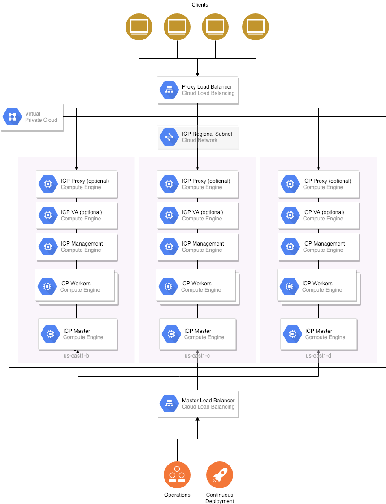

# Terraform for IBM Cloud Private on Google Cloud Platform

This Terraform configuration uses the [Google Cloud provider](https://www.terraform.io/docs/providers/google/index.html) to provision virtual machines using Google Compute Engine and deploys [IBM Cloud Private (ICP)](https://www.ibm.com/cloud-computing/products/ibm-cloud-private/) on them.  This Terraform template automates best practices learned from installing ICP at numerous client sites in production and applying them to cloud-native resources on Google Cloud Platform.

This template (on the [`master` branch](https://github.com/ibm-cloud-architecture/terraform-icp-gcp/tree/master)) provisions a highly-available cluster with ICP 3.1.0 Enterprise Edition.

* [Infrastructure Architecture](#infrastructure-architecture)
* [Terraform Automation](#terraform-automation)
* [Installation Procedure](#installation-procedure)
* [Community Edition](#installation-procedure-community-edition)
* [Cluster access](#cluster-access)
* [GCE Cloud Provider](#gce-cloud-provider)
* [Known Issues](#known-issues)

## Infrastructure Architecture

The following diagram outlines the infrastructure architecture.



- A global VPC and regional subnets are created.  
- The ICP components are deployed across three availability zones in the region.  
- Cloud Load Balancers are set up for inbound traffic to applications and control plane.  
  - Since Cloud Load Balancers only support HTTP healthchecks, a small NodeJS healthcheck container runs on the masters that exposes `/healthz` healthcheck from the API server on plain HTTP listening on port 3000.  Firewall rules will only allow the Google healthcheck subnet to access this port.
- (Not pictured) Cloud NAT is set up for outbound Internet connections.
- (Not pictured) Firewall rules are set up between cluster nodes
- (Not pictured) Google Filestore is used for image registry persistence

### VM instance sizes

See [documentation](https://www.ibm.com/support/knowledgecenter/en/SSBS6K_3.1.1/installing/plan_capacity.html) for examples of ICP node sizings.  We have provided some defaults here.

| Node | Count | CPU | Memory | Disk | Comments |
|------|-------|-----|--------|------|----------|
| Boot | 1 | 2 | 4 | 100 + 100 | used for installation only |
| Master |1 or 3| 8 | 32 | 100 + 100 | 3 for HA, 1 for ICP-ce  |
| Management | 3 | 8 | 16 | 100 + 100 | Specify larger disks for more log storage.  If 0 management nodes are specified, all management pods are placed on master nodes.  Monitoring and logging can be disabled by specifying `monitoring` and `logging` in the `disabled_management_services` list. |
| Proxy | 0 |2 | 4 | 100 + 100 | Dedicated nodes are not required; will run the nginx ingress controller on the masters if set to 0.  You can install [nginx-ingress](https://github.com/helm/charts/tree/master/stable/nginx-ingress) or [gce-ingress](https://github.com/helm/charts/tree/master/stable/gce-ingress) if a standalone ingress controller is required.  |
| VA | 0| 8 | 16 | 100 + 100 | Optional, set to 0 by default, not supported in ICP-CE  |
| Worker |3+| 4 | 16 | 100 + 100 | add additional CPU, Memory, and Disk depending on your workload  |

## Terraform Automation

### Prerequisites

1. To use Terraform automation, download the Terraform binaries [here](https://www.terraform.io/).

   On MacOS, you can acquire it using [homebrew](brew.sh) with following command:

   ```bash
   brew install terraform
   ```

1. Create regional Google Storage bucket in the same region that the ICP cluster will be created and upload the ICP binaries.  Make note of the bucket name.  You can use the `gsutil` command that comes with the [Google Cloud SDK](https://cloud.google.com/sdk/) to do upload the binaries.  

  For ICP 3.1.0-EE, you will need to copy the following:
  - the ICP binary package tarball (`ibm-cloud-private-x86_64-3.1.0.tar.gz`)
  - ICP Docker package (`icp-docker-18.03.1_x86_64`)

  For example, if my bucket is named `my-icp-binaries`:

  ```bash
  gsutil cp ./ibm-cloud-private-x86_64-3.1.0.tar.gz gs://my-icp-binaries
  ```

1. Create a file, `terraform.tfvars` containing the values for the following:

|name | required                        | value        |
|----------------|------------|--------------|
| `region`   | yes           | Region that the ICP cluster will be created in.  By default, uses `us-central1`.  Note that for an HA installation, the selected region should have at least 3 availability zones. |
| `project`   | yes           | Project (the actual project ID) that the ICP cluster will be created in. |
| `zones`          | yes           | Availability Zones that the ICP will be created in, e.g. `[ "a", "b", "c"]` to install in three availability zones.  By default, uses `["a", "b", "c"]`.  Note to select the region that has at least 3 availability zones for high availability, and that `us-east1` should use `["b", "c", "d"]`.  |
| `ssh_user`     | yes          | Username to ssh into the instances as, will be created     |
| `ssh_key`     | yes          | SSH public key to add to the compute instances, will be added     |
| `image` | no | Base image to use for all compute instances.  This is a map containing a `project` and `family` that corresponds to an OS image.  By default, we use `project = "ubuntu-os-cloud"` and `family = "ubuntu-1604-lts"`.  We have also tested with `project = "rhel-cloud"` and `family = "rhel-7"` for the latest RHEL 7.x image. |
| `docker_package_location` | no         | Google Cloud Storage URL of the ICP docker package for RHEL (e.g. `gs://<bucket>/<filename>`). If this is blank and you are using Ubuntu base images, we will use `docker-ce` from the [Docker apt repository](https://docs.docker.com/install/linux/docker-ce/ubuntu/).  If Docker is already installed in the base image, this step will be skipped. |
| `image_location` | yes         | Google Cloud Storage URL of the ICP binary package (e.g. `gs://<bucket>/ibm-cloud-private-x86_64-3.1.0.tar.gz`). The automation will download the binaries from Google Cloud Storage and perform a `docker load` on the boot node instance. |
| `icp_inception_image` | no | Name of the bootstrap installation image.  By default it uses `ibmcom/icp-inception:3.1.0-ee` to indicate 3.1.0 EE, but this will vary in each release. |

See [Terraform documentation](https://www.terraform.io/intro/getting-started/variables.html) for the format of this file.

1. If using a user-provided TLS certificate containing a custom DNS name, copy `icp-router.crt` and `icp-router.key` to the `cfc-certs` directory.  See [documentation](https://www.ibm.com/support/knowledgecenter/en/SSBS6K_3.1.0/installing/create_ca_cert.html) for more details.  The certificate should contain the `cluster_cname` as a common name, and the DNS entry corresponding should be an A record pointing at the created load balancer IP address of the master console.

1. Provide Google credentials following the instructions [here](https://www.terraform.io/docs/providers/google/getting_started.html#adding-credentials).  The keyfile will be saved as a JSON that you can add to the environment before Terraform execution:

   ```bash
   export GOOGLE_CREDENTIALS=/path/to/google/credentials.json
   ```

1. Initialize Terraform using this command.  This will download all dependent modules, including the [ICP installation module](https://github.com/ibm-cloud-architecture/terraform-module-icp-deploy).

   ```bash
   cd icp-ee
   cp terraform.tfvars .
   terraform init
   ```

## Installation Procedure

1. Examine the Terraform plan.  This will print out all the resources that would be created.

   ```bash
   terraform plan
   ```

1. Run this command to execute the commands and create the resources.

   ```bash
   terraform apply
   ```

   Please note that this step may take more than 2 hours as installation binaries are copied from Google Object Storage and loaded into the boot node.

To delete the cluster, run:

```bash
terraform destroy
```

## Community Edition

The IBM Cloud Private Community Edition is available in the `icp-ce` directory.  This will pull all the images off of [Docker Hub](https://hub.docker.com/r/ibmcom/icp-inception-amd64) so the binary install package does not need to be uploaded to Google Cloud Storage.  This is mostly the same as ICP Enterprise Edition but cannot deployed in HA.  As such the master node is given a Public IP address instead of using a Cloud Load Balancer.

## Cluster access

On success, the Terraform will output the URL to connect to for cluster access, and the generated username and password to use to log in.

## GCE Cloud Provider

The GCE cloud provider is enabled in the templates.  The GCE cloud provider provides the following:

* Service type `LoadBalancer` results in a GCE Load Balancer providing internet access to the service.
* `PersistentVolumeClaim` resources result in a Google Persistent Disk created dynamically and attached to the node of pods that mount them..  By default the terraform automation will create three storage classes providing three different classes, `pd-standard` (set as the default), `pd-ssd`, and `pd-regional`.
* Nodes are automatically labeled with the region and zone they are running in
* Routes for the pod networks are automatically created in the network.  Calico IPAM is set to `host-local` mode.

## Known Issues

* ICP 3.1.1 is not supported due to a known issue with initialization during bootstrap.
* In ICP 3.1.0 and earlier, the options to configure Calico IPAM in host-local mode are not exposed in the installer.  To address this, there is a post-install script that configures Calico and restarts all pods in `kube-system`.  This is not required in ICP 3.1.2 (and the post-install step is skipped).
* On `terraform destroy`, destroying the VPC will fail because routes are added to the VPC network by the GCE cloud provider outside of terraform.  To address this, you will need to manually delete the routes in the VPC network after the VM instances are deleted and run `terraform destroy` again so terraform can finish deleting the VPC network.
